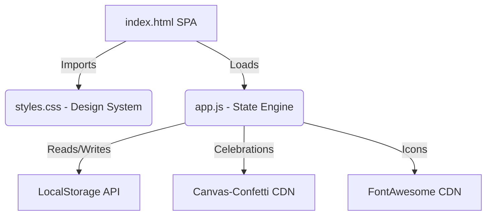

# MetasTracker: Serverless Neo-Brutalist Habit & Goal Management Platform

A highly responsive, offline-first, client-side Single Page Application (SPA) designed to track daily habits, side projects (via a Kanban Board pipeline), and high-level career milestones. The application is styled with a premium retro neo-brutalist theme, featuring Space Mono typography, warm cream tones, custom category pastels, charcoal borders, and active key-press mechanical interactions.

---

## Technical Overview & Architecture

MetasTracker operates completely client-side. It does not require any backend database or server rendering, making it cost-free to host on static web hosts (e.g., Vercel, Netlify, GitHub Pages) and highly search-engine friendly for Google AdSense monetization.



### 1. State Engine & Lifecycle (`app.js`)
* **State Management**: The application state is declared in a unified JavaScript Object (`state`) consisting of collections for `habits`, `projects`, `milestones`, and `dailyLog`.
* **State Hydration**: On initialization, the script attempts to load and parse state from the browser's `localStorage` under the namespace key `metas_tracker_state`. If null, it boots using a default pre-populated demo structure.
* **Auto-Reset Routine**: The engine compares the recorded `lastOpenedDay` against today's date on boot. If a day rollover is detected, all daily habit completion counters (`current`) are safely reset to `0` while current streak trackers are preserved.
* **Mutations & Persistence**: Every CRUD operation and checklist/counter update triggers the sync routing `saveState()`, serializing the modified state back to `localStorage`.

### 2. Modules & Core Systems

#### A. Daily Habits & Streaks
* Quantitative daily counters (e.g., studing minutes, job application submissions) with real-time numeric modifiers.
* Active calculation checks. If `current >= target` for the first time on a given day, the system increments the streak counter and writes the timestamp.

#### B. Kanban Project Pipeline
* Project cards organized across three pipeline columns: `idea`, `in-progress`, and `completed`.
* Cards render dynamic checklists, computing completion progress percentages.
* Instant visual DOM transition buttons allow status changes on click.

#### C. Career & Life Milestones
* Strategic goals mapped with target deadlines and actionable steps.
* Features nested lists with individual state toggle listeners.
* High-visibility progress bars styled with custom pastel accents.

### 3. Analytics & Visualization Rendering
* **Raw CSS/HTML Bar Charts**: The weekly performance graph is rendered programmatically by computing values relative to a target max scale (10 units), updating column height percentages, and rendering clean vertical bar items in the DOM.
* **Category Distribution List**: Evaluates the categories array to generate color-coded progress bars showing user activity focus distribution.

### 4. Data Interoperability (Backup & Restore)
* **JSON Serialization**: Exports the state object as a URL-encoded JSON download stream.
* **JSON Deserialization**: Accepts uploaded files via standard `<input type="file">`, runs a structural safety verification check for required fields, and hydrates the DOM state if valid.

---

## Design System Configuration (`styles.css`)

The interface applies **Neo-Brutalist Retrofuturistic** layouts optimized for usability and gentle contrast:

| Utility / Token | Property / Value | Purpose |
| :--- | :--- | :--- |
| **Main Background** | `#faf6eb` (Warm Cream) | Emulates vintage paper, avoiding blue light harshness. |
| **Sidebar Background** | `#c5e4cf` (Sage Pastel Green) | Soft layout division inspired by terminal green. |
| **Outlines** | `1.5px solid #333333` (Charcoal) | Gentler outlines compared to raw dark borders. |
| **Box Shadows** | `3px 3px 0px #333333` (Flat offsets) | Adds brutalist tactile thickness without blur. |
| **Corners** | `10px` to `14px` (Border-radius) | Softens cards and buttons for a gentler UI feel. |
| **Fonts** | `'Space Mono'` & `'Plus Jakarta Sans'` | Space Mono for indicators and titles; Sans-serif for copy. |

---

## Local Development & Setup

1. Clone or download this project folder.
2. Serve the directory using any static web server:
   ```bash
   # Using Node.js (http-server)
   npx http-server -p 8080 -c-1

   # Using Python
   python -m http.server 8080
   ```
3. Open `http://localhost:8080` in your web browser.

---

## Deploying to Vercel (Production)

This project requires zero configuration for production hosting:

1. Push your folder files directly to a **GitHub** repository.
2. Go to **Vercel.com**, log in, and import the repository.
3. Vercel automatically detects the static HTML project. Click **Deploy**.
